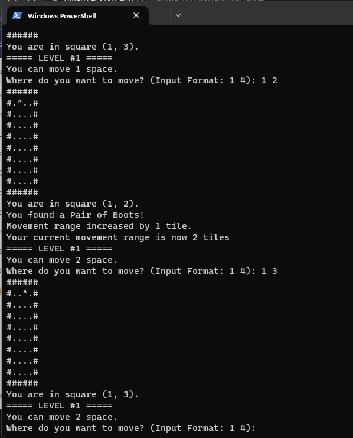

# Rust Starship Crawler
## Lee Hoang, Tou Xiong, Hanna Kostrba
## 4/23/2023

## Description

### What is the project about?

This is a roguelike game where the player is an explorer investigating an abandoned starship for its secrets. Along the way, the player will find hidden treasures, useful powerups, and terrifying monsters.

Every room is procedurally generated, meaning the player will never encounter the same rooms twice.

### How to build and run the project

1) Open a terminal (Windows command line, Powershell, etc.) and clone the repository with the command below:

    ```
    git clone https://gitlab.cecs.pdx.edu/cs510-rust-lth/rust-starship-crawler.git
    ```

2) cd into the project directory:

    ```
    cd rust-starship-crawler
    ```

3) Execute the following commands to build the project

    ```
    cargo check
    cargo clippy
    ```

4) Run the project with the command

    ```
    cargo run
    ```

### Testing

We tested all aspects of the game to ensure that the player could carry out the basic activities. 

#### Manual testing

1) From one square, we executed move commands to move diagonally, up/down, and left/right and ensured that the new position was reflected on the map without crashes.

#### Automated testing

1) We wrote a test `test_new_proc_room()` to check that every procedurally generated room is within the width and height parameters.


### How to play

1) Open a terminal and type the command 

    `cargo run`

2) When prompted, enter your name.

3) You will be shown a map and your current position. To move on the map, enter the x-coord and y-coord of the square you want to move to.

    Example: If you are on square (1, 4) and you want to move to square (2, 4), enter `2 4`.

    Note that you can only move one square at a time unless you have the "Pair of Boots" pickup, which lets you move two squares at a time.

4) If your destination square contains a pickup, the pickup will either restore 20 HP (Medkit), boost your attack power by 10 (Knife), or increase your movement range by 1 (Pair of Boots).

5) When you get close to an enemy, it will appear and you will enter a battle. To attack, press the enter key.

    The battle runs until either the player or the enemy is defeated.

6) When you defeat an enemy, you will move to the next room (or the next floor if you are in the last room of the current floor).

7) If your HP reaches 0, the game will end and you will need to restart from the beginning. 

# Example



# What worked

TBD 

# What didn't work

TBD

# Future work

* More enemy types
* More bosses
* Player can carry multiple weapons and thus have multiple attack types

# References

Lee: I reused code from HW3 to help set up the dungeon room.

The code we reused was based on the code to define (`struct`), implement (`impl`), and display (`show_posn`) the Chomp board.

Definition of a Roguelike game:
https://en.wikipedia.org/wiki/Roguelike

Rand Crate reference:
https://docs.rs/rand/latest/rand/trait.Rng.html#method.gen_range


# License file

This project uses the "MIT License."

Please see the `LICENSE` file for license terms.