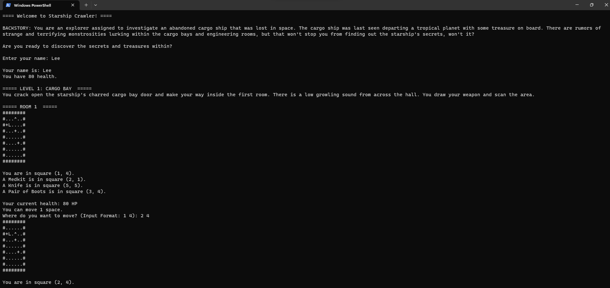

# Rust Starship Crawler

## Lee Hoang, Tou Xiong, Hanna Kostrba

## 4/23/2023

## An intergalactic command-line rogue-like adventure game in Rust

### What is the Project About?

This is a roguelike game where the player is an explorer investigating an abandoned starship for its secrets. Along the way, the player will find hidden treasures, useful powerups, and terrifying monsters.
Every room is procedurally generated, meaning the player will never encounter the same rooms, enemies, and pickups twice.

### How to Build and Run the Project

1. Open a terminal (Windows command line, Powershell, etc.) and clone the repository with the command below:

   ```
   git clone https://gitlab.cecs.pdx.edu/cs510-rust-lth/rust-starship-crawler.git
   ```

2. cd into the project directory:

   ```
   cd rust-starship-crawler
   ```

3. Execute the following commands to build the project:

   ```
   cargo check
   cargo clippy
   ```

4. Run the project with the following command:

   ```
   cargo run
   ```

### How to Play

1. Open a terminal and type the command:

   `cargo run`

2. When prompted, enter your name.

3. You will be shown a map of the current room you are in. Your current location is indicated by an '^' symbol on the map, and supplementary text will inform you what tile you are currently on. 
To move on the map, enter the x-coordinate and y-coordinate of the tile you want to move to.

   Example: If you are on square (1, 4) and you want to move to square (2, 4), enter `2 4`.

   **Note:** You can only move one square at a time unless you have the "Pair of Boots" pickup, which will let you move up to two tiles at a time.

4. If your destination square contains a pickup, your character will pick up the item. Pickups can have the following effects:
    - Restoring HP (medkit)
    - Boosting your damage (knife)
    - Increasing your movement range by one (pair of boots)

5. When you get close to an enemy, it will appear and you will enter a battle. To attack, press the 'Enter' key.
   The battle runs until either the player or the enemy is defeated.

6. When you defeat an enemy, you will move to the next room (or the next floor if you are in the last room of the current floor).

7. If your HP reaches 0, the game will end and you have the option to either restart the game from the first level or quit the game.

# Example

## Starting the game:



## Picking up a pair of boots


### Testing

We tested all aspects of the game to ensure that the player could carry out the basic activities. This was done through two different methods: manual testing and automated testing. Manual testing was necessary for a decent amount of the features that we implemented, since there are a lot of features that rely upon user input.

#### Manual Testing

1. From one square, we executed move commands to move diagonally, up/down, and left/right, and ensured that the new position was reflected on the map without crashes.
2. We executed move commands to pick up items in each room and ensured that the effects stuck when taking the player into combat.
3. Similarly, once movement pick-up items were implemented, we tested the way the increased movement impacted our current movement function in a similar manner to the method that was described in 1.
4. Enemy/player interactions were tested manually as, well, by ensuring that the current implementation of our enemy_found() function (which ascertains whether or not the player has "found" the enemy on the board), by moving to different locations around the enemy that--hypothetically--would flag the enemy as "found" by the player, and ensuring that moving to these positions resulted in the intended behavior of the enemy being found.
5. Once the restart feature was implemented, we manually tested the loop logic involved with the feature to ensure that--should the player choose to restart--they are sent back to the beginning of the game (level one, room one), as well as ensure that the inclusion didn't affect any of the already existing game logic.
6. Once the attack vectors were added to Entities and multiple attacks were added to enemies, there was testing to ensure that the enemies both had access to and used the different attacks that were added to their attack vectors.
7. Similarly, once the backpack vector was added to Entities, this feature was manually tested to ensure the validity of the results produced (as well as ensuring that the "Pair of Boots" pickup was being checked for), by manually picking up the items within the game environment

#### Automated Testing

1. We wrote a test, `test_new_proc_room()`, to check that every procedurally generated room is within the width and height parameters.
2. Wrote a test, `test_regenerate_health()`, to ensure that the regenerate_health() function was properly regenerating health to the player entity.
3. Wrote a test, `test_generate_pickup()`, to ensure that the generate_pickup() function returned a non-empty pickup entity that contained all of the anticipated values of the pickup type (based on the static values that they currently have as of 6/13/23)
4. In addition to these tests, there was also a test titled `test_health_pickup()` that was created. This test function ensured the validity of the apply_pickup_effect() function's behavior when working with health pickup items (i.e. properly raising the health by the right amount/not letting the player raise more than 100 HP through the use of medkits)
5. There was also a test titled `test_attack_pickup()` that was created to test the validity of the behavior of apply_pickup_effect()'s behavior with attack pickups by ensuring that the player's attack is raised by the correct amount.
6. Finally, a test to test the movement pickup (titled `test_movement_pickup()`), was created to ensure that apply_pickup_effects()'s behavior with movement pickups was the anticipated behavior

# What Worked

- Displaying the enemy once the player is in close proximity to the enemy 
- Autogenerating rooms with different dimensions, enemies, and pickups
- Adding logbooks into the game to provide the player with game lore
- Adding the ability for the player to pick up items to increase their stats(EX: weapons for attack power-ups, medkits to regenerate health, and boots to increase the player's movement range)
- Adding a "backpack" to allow players to store their picked-up items (except for the medkit)

# What Didn't Work

- Some issues stemmed as a result of enemies and pickups spawning too close to each other on the map. This would result in the player moving to a pickup tile, and instead initiating combat with the enemy before being able to pick up the item (this was patched by changing the minimum height that a room can be to 7)
- Implementing randomized enemy/pick-up locations. As of right now, this is one of the future development plans, however, quite a decent chunk of movement/initialization code may need to be altered to properly implement randomized pick-up and randomized enemy locations in the game.
- Small room generation. As a side-effect of the way that enemy location is implemented as of right now, small rooms aren't on the table. If the room is too small, the enemy is found immediately upon player spawn, which creates issues with the battle mechanics. Similarly, if the room is a little larger (but still small) the player isn't able to properly move around without finding the enemy on their first or second turn, which detracts from the overall experience of the game.
- Movement range beyond two tiles. The largest problem that arose as a result of this was players being able to move across the entire room if they had enough of the pickup. This is why the implementation of the backpack/restricting the amount of movement pickups a player could obtain was important

# Future Work

We plan to include the following features (the list is not exhaustive) in future versions of this game:
- More enemy types
- More bosses
- Enemies can move around the map
- Randomized enemy/pickup start locations
- Multiple enemies in one room (this will require expanding the minimum room size)
- Player can carry multiple weapons and thus have multiple attack types
- Player moves using arrow keys instead of inputing coordinates

# References

Lee: I reused code from HW3 to help set up the dungeon room and to move the player around via coordinate input.

The code we reused was based on the code to define (`struct`), implement (`impl`), and display (`show_posn`) the Chomp board.

Definition of a Roguelike game:
https://en.wikipedia.org/wiki/Roguelike

Rand Crate reference:
https://docs.rs/rand/latest/rand/trait.Rng.html#method.gen_range

# License file

This project uses the "MIT License."

Please see the `LICENSE` file for license terms.
